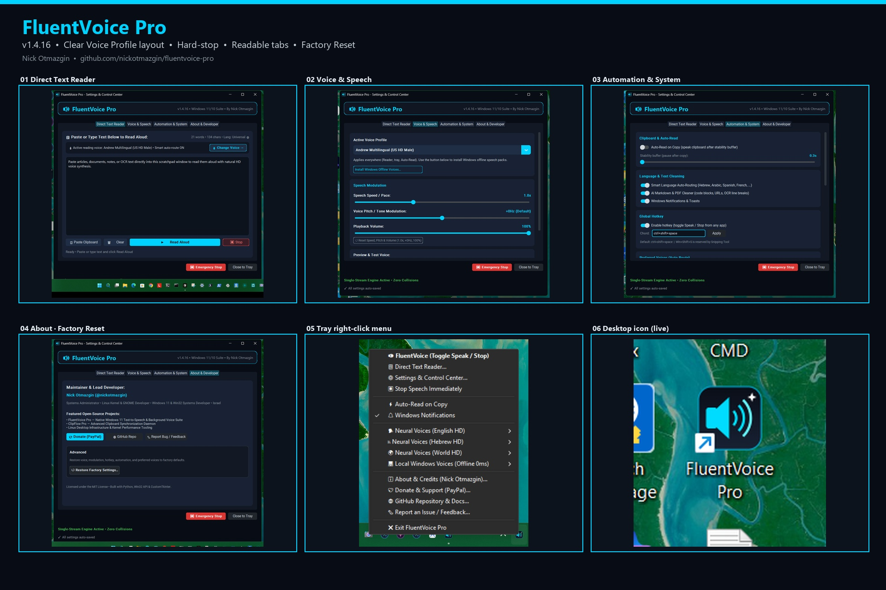
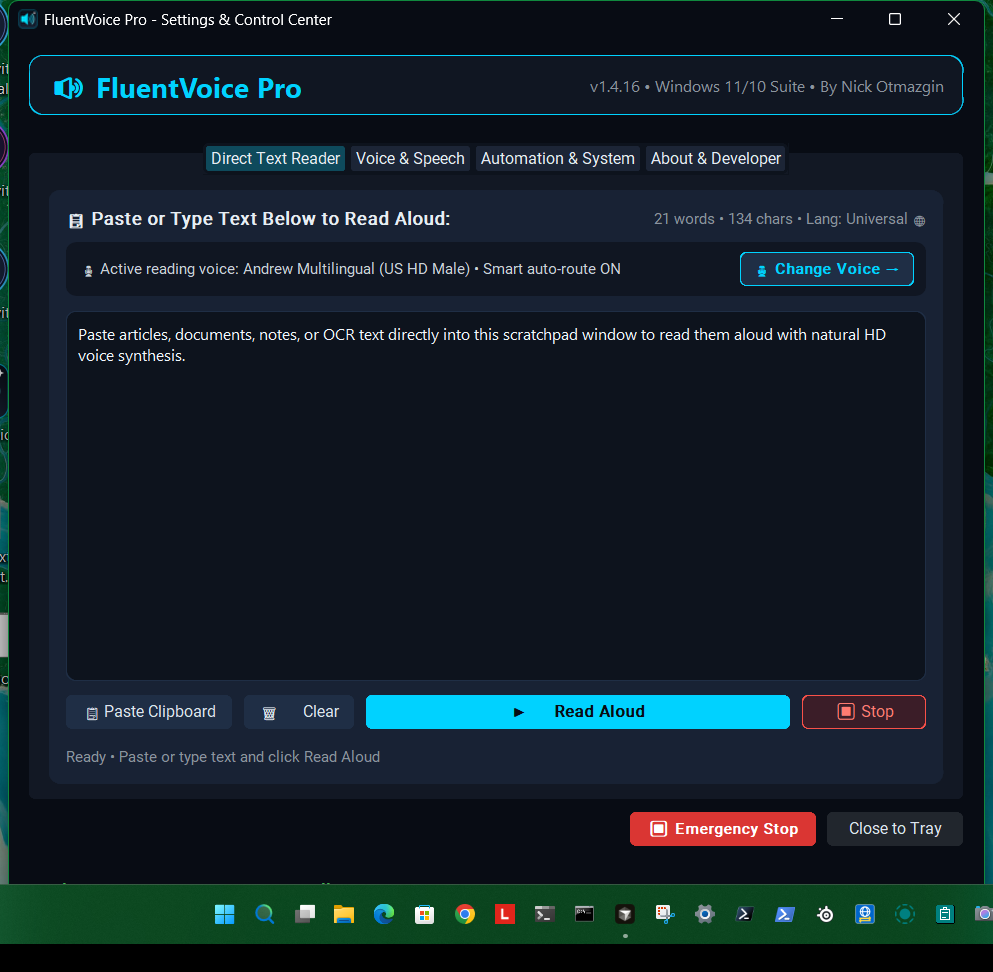
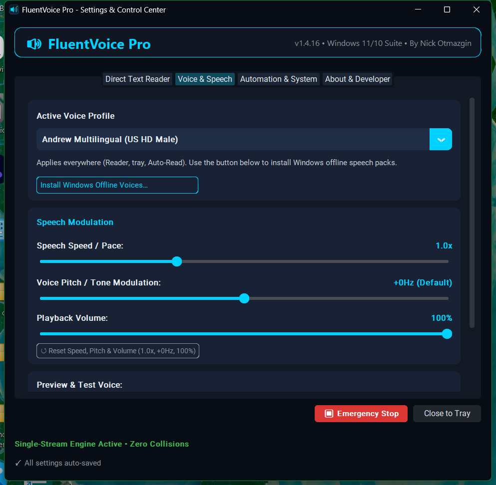
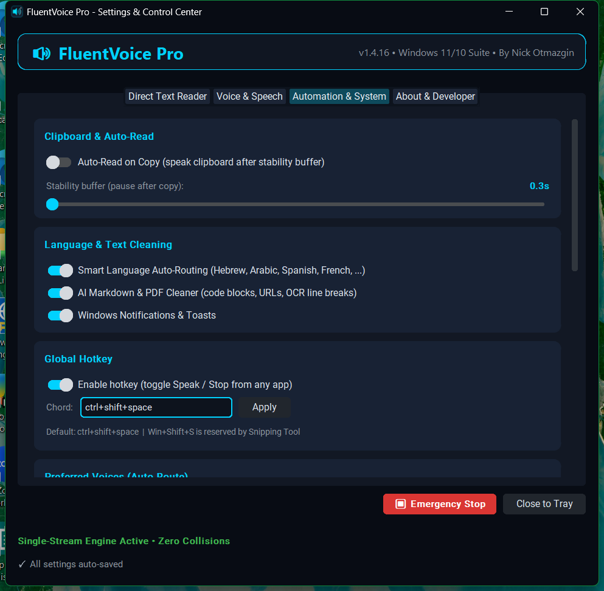
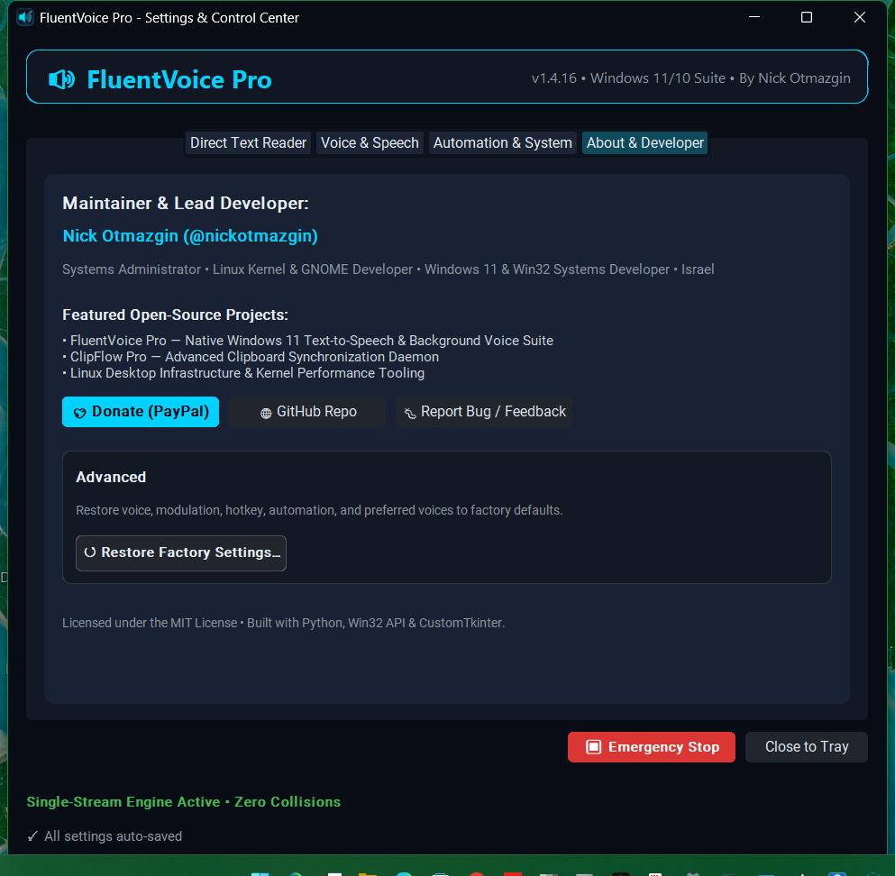
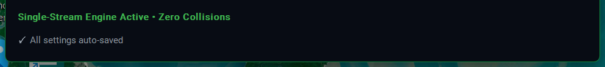
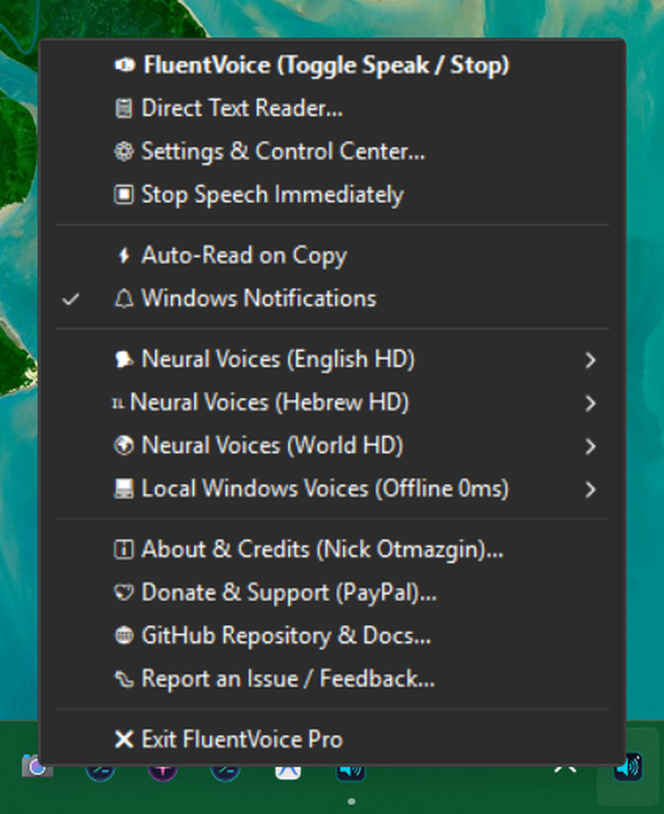
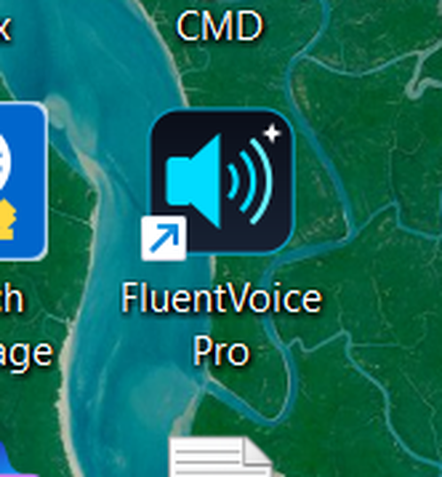
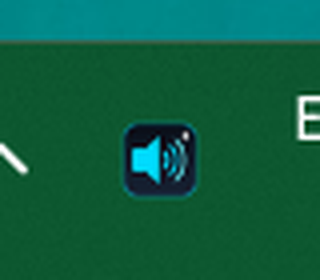

# FluentVoice Pro

[](https://github.com/nickotmazgin/fluentvoice-pro/releases/latest)
[](https://github.com/nickotmazgin/fluentvoice-pro/actions)
[](https://github.com/nickotmazgin/fluentvoice-pro/releases)
[](LICENSE)
[](#compatibility)
[](#compatibility)
[](#architecture)

[](https://github.com/nickotmazgin/fluentvoice-pro/issues)
[](https://github.com/nickotmazgin/fluentvoice-pro/discussions)

**FluentVoice Pro** is a modern, lightweight Native Desktop Application and System Tray Suite for **Windows 11 and Windows 10** that reads aloud any text across your entire operating system.

Equipped with a **Windows 11 Fluent UI Settings & Control Center**, global single-stream playback locking (zero voice collisions), multi-engine neural voice synthesis, and automatic zero-latency offline fallback.

> **Latest: v1.4.16** — Clearer Active Voice Profile layout; hard-stop speech; readable tabs; notification tact; extra neural voices. Attested ZIP + portable EXE. See **[Releases](https://github.com/nickotmazgin/fluentvoice-pro/releases/latest)**.

> **Keywords:** Windows 11 Desktop App · System Tray Suite · Text to Speech · Read Aloud · Natural Voice Reader · Fluent Design · CustomTkinter · Edge TTS · SAPI OneCore · Clipboard Reader · Scratchpad · Multi-Language · Accessibility · Open Source

---

## Screenshots

*FluentVoice Pro **v1.4.16** — click any image to view it full size.*

[](screenshots/v1.4.16/collage-v1.4.16-2026.jpg)

<table>
  <tr>
    <td align="center">
      <a href="screenshots/v1.4.16/01-settings-reader.png"></a><br>
      <b>01</b> — Direct Text Reader
    </td>
    <td align="center">
      <a href="screenshots/v1.4.16/02-settings-voice.png"></a><br>
      <b>02</b> — Voice &amp; Speech
    </td>
    <td align="center">
      <a href="screenshots/v1.4.16/03-settings-automation.png"></a><br>
      <b>03</b> — Automation &amp; System
    </td>
  </tr>
  <tr>
    <td align="center">
      <a href="screenshots/v1.4.16/04-settings-about.png"></a><br>
      <b>04</b> — About · Factory Reset
    </td>
    <td align="center">
      <a href="screenshots/v1.4.16/05-footer-emergency-stop.png"></a><br>
      <b>05</b> — Footer · Emergency Stop
    </td>
    <td align="center">
      <a href="screenshots/v1.4.16/06b-tray-menu-crop.png"></a><br>
      <b>06</b> — Tray right-click menu
    </td>
  </tr>
  <tr>
    <td align="center">
      <a href="screenshots/v1.4.16/00-desktop-icon-live.png"></a><br>
      <b>07</b> — Desktop icon (live)
    </td>
    <td align="center">
      <a href="screenshots/v1.4.16/05c-tray-icon-closeup.png"></a><br>
      <b>08</b> — Tray icon close-up
    </td>
  </tr>
</table>

Full combined image (download): [collage-v1.4.16-2026.jpg](screenshots/v1.4.16/collage-v1.4.16-2026.jpg)

---

## What Kind of Software Is FluentVoice Pro?

FluentVoice Pro is a **Native Windows 11 Desktop Application & Background System Tray Suite**.

- **Not a browser extension:** It is not restricted to browser tabs. It works everywhere across Windows: Cursor, VS Code, Slack, PDF readers, Notepad, Office, File Explorer, and terminals.
- **Not a bulky screen hog:** It runs quietly as an ultra-lean (<35 MB RAM) background daemon in your notification area next to the clock.
- **Full Graphical Control Center:** When you want to tweak settings, adjust voice speed, or test voices, double-click the **FluentVoice Pro** desktop icon or right-click the tray to open the modern dark-themed Fluent Control Center.

---

## Highlights & Features

- 🛡️ **Guaranteed Single-Stream Playback (Zero Collisions):** An atomic generation tracker ensures that starting or requesting new speech instantly cancels any in-flight download and stops prior playback. No overlapping voices, ever.
- 📋 **Dedicated Direct Text Reader & Scratchpad:** Full-fledged scratchpad window in the Control Center to paste, review, and read long articles, PDFs, OCR texts, or code notes with live word/char counters and language tags.
- 🌐 **Smart Language Auto-Routing:** Detects Hebrew, Arabic, Japanese/CJK, and Latin languages (Spanish, French, German, Italian, English) and switches to your preferred native HD voice (e.g. Avri vs Hila).
- ⏳ **Instant Synthesis Queue & Preparation Alerts:** Eliminates waiting ambiguity during cloud voice generation with real-time `⏳ Synthesizing...` feedback followed by seamless playback.
- 🧹 **Advanced PDF, OCR & Niqqud Text Sanitizer:** Automatically repairs hyphenated line wraps from PDF copy-pastes, normalizes Unicode (NFKC), strips invisible zero-width and bidirectional markers, and cleans code blocks and markdown.
- 🎛️ **Modern Fluent UI Control Center:** Dark Fluent UI with voices, pitch, **volume**, speed, preferred auto-route voices, tray ensure/restart, and automation.
- ⌨️ **Global Hotkey:** Configurable chord (default `Ctrl+Shift+Space`) toggles speak/stop from any app.
- 🔔 **Windows Toast & Popup Notifications:** Sleek native Windows notification popups for voice changes, auto-read toggle events, and active speech playback—fully configurable in settings.
- 🗣️ **Ultra HD Multilingual Voices (English, Hebrew & World Languages):** Studio-grade Microsoft Neural voices (`Andrew`, `Ava`, `Jenny`, `Guy`, `Ryan`, `Sonia`, `Avri`, `Hila`, `Alvaro`, `Henri`, `Conrad`, `Diego`, `Hamed`, `Keita`) with lifelike inflections.
- ⚡ **Dynamic Offline Voice Discovery:** Automatically enumerates every SAPI5/OneCore voice installed on your system. Plus, a 1-click button to install more offline language packs via Windows Settings.
- 📋 **Configurable Debounced Auto-Read on Copy:** Optional mode that detects newly copied text and speaks it automatically after an adjustable stability buffer (0.3s to 1.5s).
- 🎨 **Redesigned Ultra-Crisp Tray Icon & Dark Menus:** Transparent-background high-contrast neon cyan speaker glyph with native Windows 11 dark context menus and escaped Win32 menu accelerators.
- 🖥️ **Single Unified Desktop Shortcut & Tray Revive:** Desktop launcher opens Control Center and **Close to Tray** / **Ensure Tray** bring the icon back after Exit.
- 🚀 **Silent Headless Boot:** Auto-starts silently on Windows login through a background VBS launcher—zero flashing terminal windows.
- ✅ **Smoke checklist:** See [`docs/SMOKE_TEST.md`](docs/SMOKE_TEST.md) for a 2-minute release verification path.

---

## Compatibility

| Windows OS | Architecture | Status |
| :--- | :---: | :---: |
| **Windows 11 (24H2 / 23H2 / 22H2 / 21H2)** | x64 / ARM64 | **Validated & Recommended** |
| **Windows 10 (22H2 / 21H2)** | x64 | **Supported** |
| **Python Runtime** | 3.10 – 3.14+ | **Supported** |

---

## Installation

Two attested download options on **[Releases](https://github.com/nickotmazgin/fluentvoice-pro/releases/latest)** (green GitHub verification stamps when published by Actions):

### Option A — Source ZIP + `install.ps1` (Recommended)

1. Download **`fluentvoice-pro-<ver>-windows.zip`**.
2. Extract the folder.
3. If Windows marks it blocked: right-click → **Properties** → **Unblock** → Apply (or `Unblock-File .\install.ps1`).
4. Right-click **`install.ps1`** → **Run with PowerShell**.

Requires **Python 3.10+** on PATH.

### Option B — Portable EXE ZIP (no Python)

1. Download **`FluentVoicePro-<ver>-portable-win64.zip`**.
2. Extract anywhere.
3. Unblock **`FluentVoicePro.exe`** if needed, then double-click to start the tray daemon.

SmartScreen / App Control / firewall notes: [`docs/WINDOWS_TRUST.md`](docs/WINDOWS_TRUST.md).

### From Source / Git

```powershell
git clone https://github.com/nickotmazgin/fluentvoice-pro.git
cd fluentvoice-pro
pip install -r requirements.txt
python -m fluentvoice.installer
```

---

## Quick Start & Triggers

1. **System Tray Icon (Next to Clock):**
   - **Left-Click**: Instant Toggle (Read clipboard / Stop speech immediately).
   - **Right-Click**: Open Direct Text Reader, Settings, switch voices, toggle Auto-Read, or access developer links.
2. **Global Hotkey:** `Ctrl+Shift+Space` (change under Automation & System).
3. **Desktop Shortcut:**
   - Double-click **`FluentVoice Pro`** to open the Control Center (brings an existing window to the front; revives tray if you previously Exit'ed).
4. **Windows Explorer Context Menu:**
   - Right-click any folder or desktop background $\rightarrow$ **`FluentVoice Pro (Read Aloud)`**.
5. **Command Line (CLI):**
   ```powershell
   fluentvoice "Hello world"      # Speak specific text
   fluentvoice --clip             # Speak current clipboard
   fluentvoice --stop             # Stop speech immediately
   fluentvoice --gui              # Open Settings & Control Center
   fluentvoice --reader           # Open Direct Text Reader scratchpad
   fluentvoice --about            # Open About & Credits window
   ```

---

## Architecture & Concurrency Model

```text
[ Trigger: Click / Shortcut / Auto-Copy ]
                   │
                   ▼
       [ Atomic Generation Token (Gen ID++) ] ────► Invalidate prior downloads
                   │
                   ▼
        [ Instant Hard Audio Purge ] ──────────► Stop MCI alias & SAPI
                   │
         ┌─────────┴─────────┐
         ▼                   ▼
  [ Neural Engine ]   [ Local SAPI/OneCore ]
  (Edge HD WebSocket)  (Instant 0ms Offline)
         │                   │
         └─────────┬─────────┘
                   ▼
    [ Generation Valid Check ] ────────► If Gen != Active: DISCARD
                   │
                   ▼
  [ Named MCI Device Playback ] ──────► "FluentVoiceDevice" (Single Stream)
```

---

## Links

- **Releases:** https://github.com/nickotmazgin/fluentvoice-pro/releases
- **Issues:** https://github.com/nickotmazgin/fluentvoice-pro/issues
- **Discussions:** https://github.com/nickotmazgin/fluentvoice-pro/discussions
- **Security:** [`SECURITY.md`](SECURITY.md) · [Report a vulnerability](https://github.com/nickotmazgin/fluentvoice-pro/security/advisories/new)
- **Privacy:** [`PRIVACY.md`](PRIVACY.md)
- **Contributing:** [`CONTRIBUTING.md`](CONTRIBUTING.md)
- **Windows trust / SmartScreen:** [`docs/WINDOWS_TRUST.md`](docs/WINDOWS_TRUST.md)
- **Smoke checklist:** [`docs/SMOKE_TEST.md`](docs/SMOKE_TEST.md)

## Other Open-Source Projects by Nick Otmazgin

- [ClipFlow Pro](https://github.com/nickotmazgin/clipflow-pro) — Advanced privacy-safe clipboard history manager for GNOME Shell 45–50 with pin, star, and export features.
- [Comfort Control (EaseHub)](https://github.com/nickotmazgin/comfort-control-easehub) — GNOME Shell panel menu for power, screenshots, updates & utilities.
- [Numeric Clock](https://github.com/nickotmazgin/Linux-Numeric-Date-And-Clock) — DD/MM/YYYY 24-hour top-bar clock with seconds.

---

## Credits & Acknowledgements

FluentVoice Pro is created, designed, maintained, and released by **[Nick Otmazgin](https://github.com/nickotmazgin)** — project administrator and solo maintainer.

- **Developer Email:** `nickotmazgin.dev@gmail.com`
- **Location:** Israel

[](https://cursor.com)
[](https://github.com/google/antigravity)

Built with pair-programming assistance from AI co-pilots operated under the maintainer's direction, verification, and code review:

- **Cursor Agent** — Audio engine architecture, concurrency design, UI automation, and packaging
- **Google Antigravity** — System integration, Windows desktop testing, and performance profiling

---

## Legal & Trademarks Disclaimer

> Microsoft, Windows, Windows 11, and Microsoft Edge are registered trademarks of Microsoft Corporation. FluentVoice Pro is an independent open-source project and is **not** affiliated with, sponsored, or endorsed by Microsoft Corporation. All voice synthesis APIs and endpoints are utilized strictly for personal, accessibility, and educational interoperability under fair use principles.

---

## Support & Donations

If you find FluentVoice Pro useful, consider supporting continued development and maintenance:

[](https://www.paypal.com/donate/?hosted_button_id=4HM44VH47LSMW)

---

## License

Released under the **[MIT License](LICENSE)**. Copyright © 2026 Nick Otmazgin.

---

**GitHub topics:** `text-to-speech` · `tts` · `windows-11` · `windows-10` · `system-tray` · `read-aloud` · `edge-tts` · `customtkinter` · `accessibility` · `speech-synthesis` · `clipboard-reader` · `open-source`

**Search for:** Windows 11 text to speech tray app, FluentVoice Pro, Edge TTS reader, clipboard read aloud, offline SAPI voices, Fluent Control Center TTS
