# FluentVoice Pro™

[](https://github.com/nickotmazgin/fluentvoice-pro/releases/latest)
[](https://github.com/nickotmazgin/fluentvoice-pro/actions)
[](https://github.com/nickotmazgin/fluentvoice-pro/releases)
[](LICENSE)
[](#compatibility)
[](#compatibility)
[](#architecture)

[](https://github.com/nickotmazgin/fluentvoice-pro/issues)
[](https://github.com/nickotmazgin/fluentvoice-pro/discussions)
[](https://apps.microsoft.com/detail/9N293MJ0MD9F)
[](https://alternativeto.net/software/fluentvoice-pro/about/)

**FluentVoice Pro™** is a modern, lightweight Native Desktop Application and System Tray Suite for **Windows 11 and Windows 10** that reads aloud any text across your entire operating system.

Equipped with a **Windows 11 Fluent UI Settings & Control Center**, global single-stream playback locking (zero voice collisions), multi-engine neural voice synthesis, and automatic zero-latency offline fallback.

> **Latest: v1.6.2** — when an online voice fails, the reading continues with a voice that can actually read the text (or FluentVoice says what to install) and returns to online when the service recovers; the **hotkey reads the selected text**, an optional **Stop hotkey**, a warning when another app owns your chord; the tray lists newly added Windows voices; offline HD voices start sooner. FluentVoice Pro is in the **[Microsoft Store](https://apps.microsoft.com/detail/9N293MJ0MD9F)** (free; updates and Start with Windows are handled by the Store and Windows). Still included since v1.5: **offline HD voices** (Piper & Kokoro, 57 voices in 16 languages, SHA-256 verified), the **Voice Providers** tab, **Offline only** privacy mode. Attested ZIPs + `SHA256SUMS.txt` on [Releases](https://github.com/nickotmazgin/fluentvoice-pro/releases); history in [CHANGELOG.md](CHANGELOG.md).

> **Keywords:** Windows 11 Desktop App · System Tray Suite · Text to Speech · Read Aloud · Natural Voice Reader · Fluent Design · CustomTkinter · Edge TTS · SAPI OneCore · Clipboard Reader · Scratchpad · Multi-Language · Accessibility · Open Source

---

## Demo video

*A 5-minute tour of v1.6.1, now in the Microsoft Store (real app, real voices; turn the sound on): Direct Text Reader, eight Microsoft online voices (US & UK English, Hebrew, Arabic, Spanish, French, Japanese, Hindi), the Voice Providers tab with a live Piper download and Kokoro offline voices, Offline-only privacy mode, Preferred Voices, Automation & System, About & Updates, and the tray's Offline HD Voices menu.*

https://github.com/user-attachments/assets/69232ed1-b2f7-4aae-80f1-908521427841

---

## Screenshots

*FluentVoice Pro **v1.6.2** — click any image to view it full size.*

[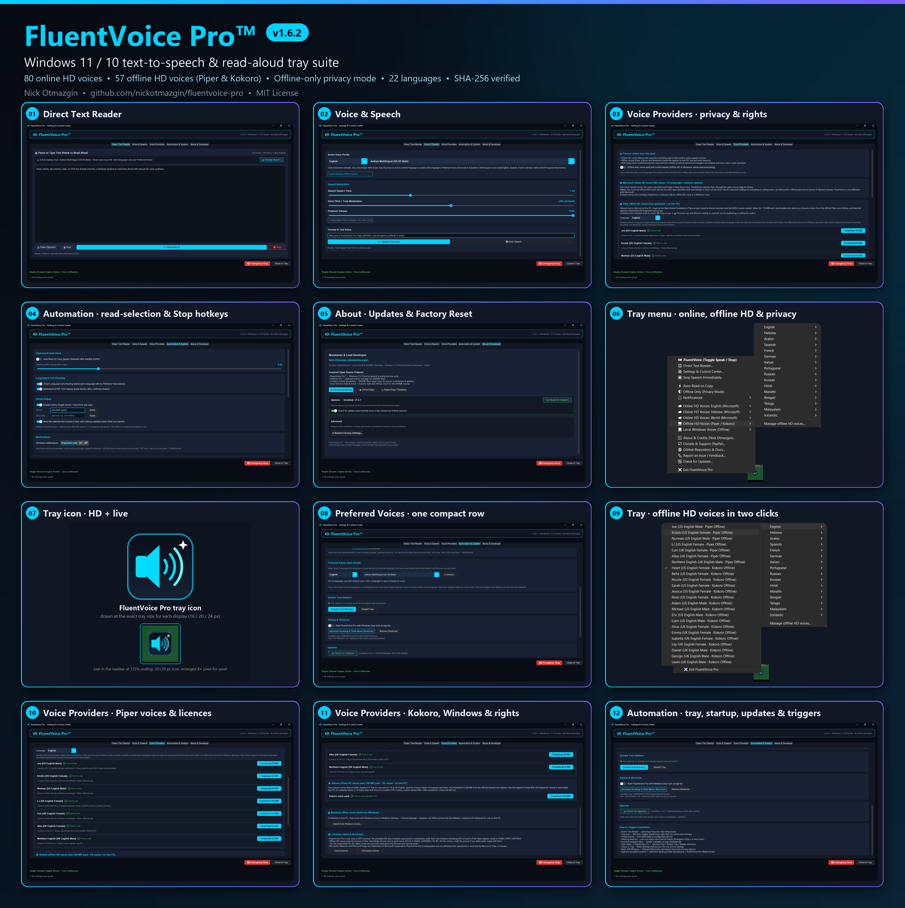](screenshots/v1.6.2/collage-v1.6.2.jpg)

<table>
  <tr>
    <td align="center">
      <a href="screenshots/v1.6.2/01-settings-reader.png">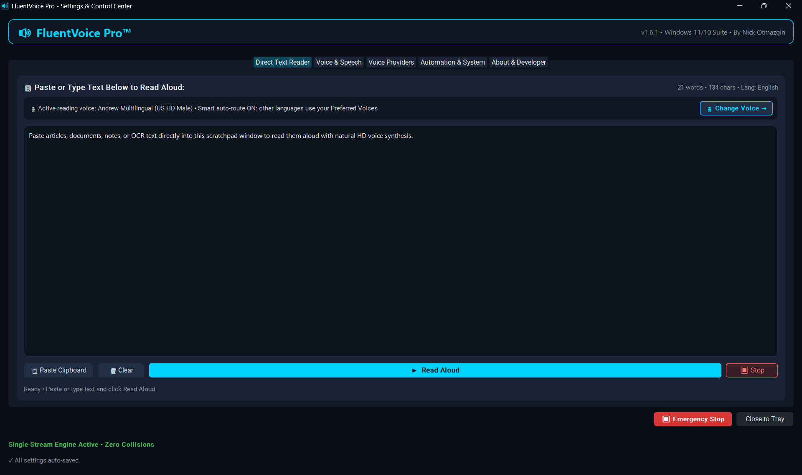</a><br>
      <b>01</b> — Direct Text Reader
    </td>
    <td align="center">
      <a href="screenshots/v1.6.2/02-settings-voice.png">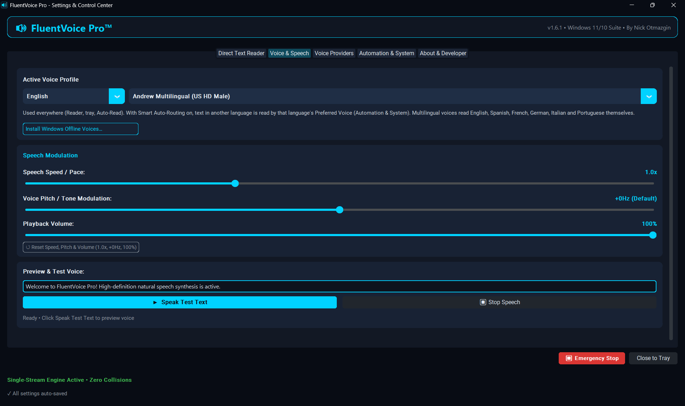</a><br>
      <b>02</b> — Voice &amp; Speech
    </td>
    <td align="center">
      <a href="screenshots/v1.6.2/03-settings-voice-providers.png">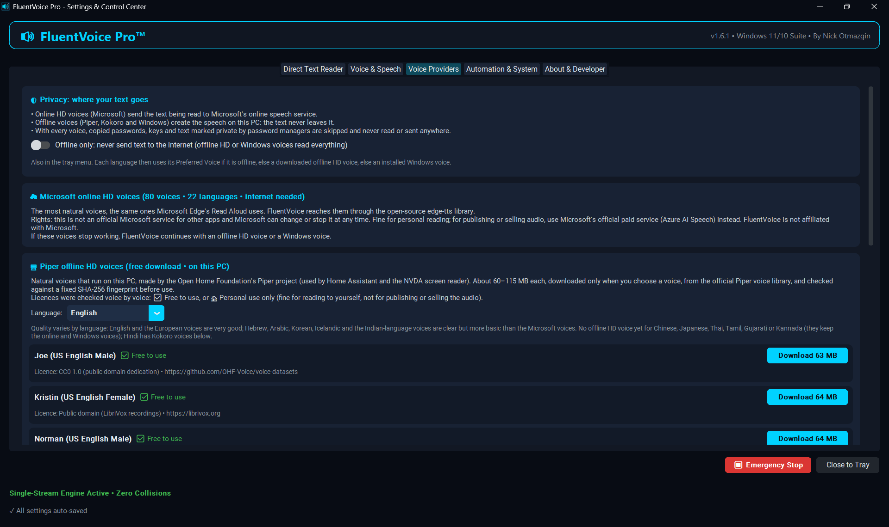</a><br>
      <b>03</b> — Voice Providers · privacy &amp; rights
    </td>
  </tr>
  <tr>
    <td align="center">
      <a href="screenshots/v1.6.2/04-settings-automation.png">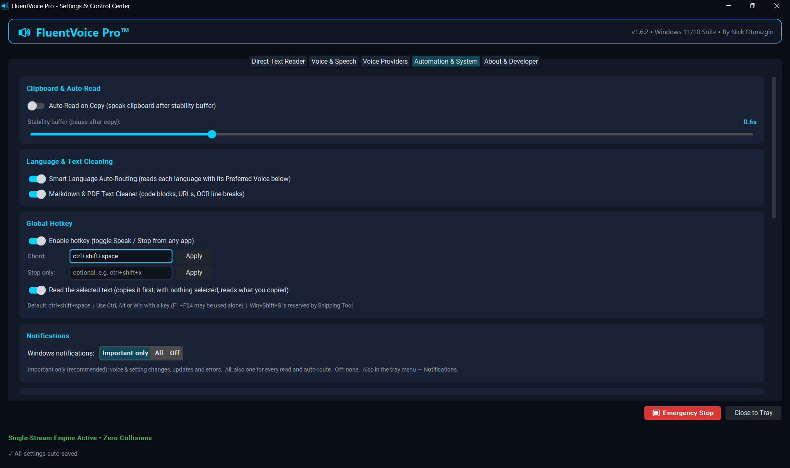</a><br>
      <b>04</b> — Automation · read-selection &amp; Stop hotkeys
    </td>
    <td align="center">
      <a href="screenshots/v1.6.2/05-settings-about-updates.png">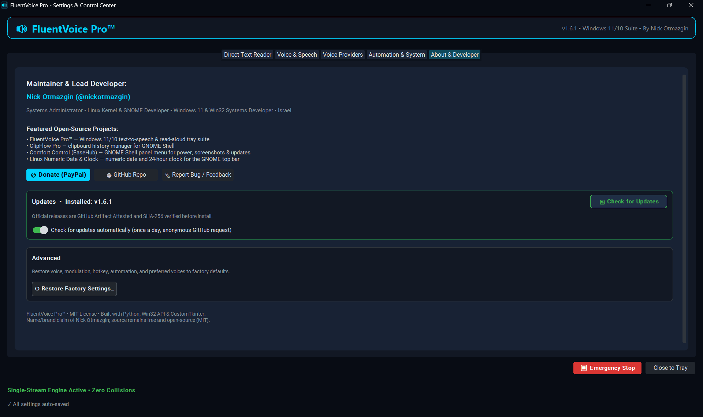</a><br>
      <b>05</b> — About · Updates &amp; Factory Reset
    </td>
    <td align="center">
      <a href="screenshots/v1.6.2/06-tray-menu.png">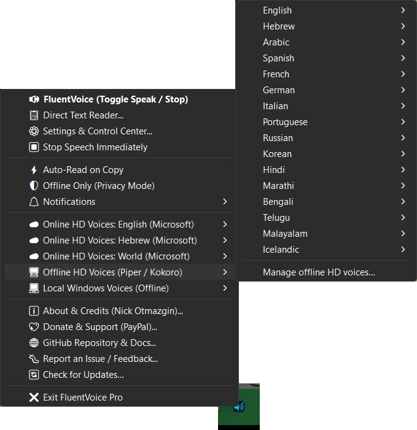</a><br>
      <b>06</b> — Tray menu · online, offline HD &amp; privacy
    </td>
  </tr>
  <tr>
    <td align="center">
      <a href="screenshots/v1.6.2/07-tray-icon-closeup.png">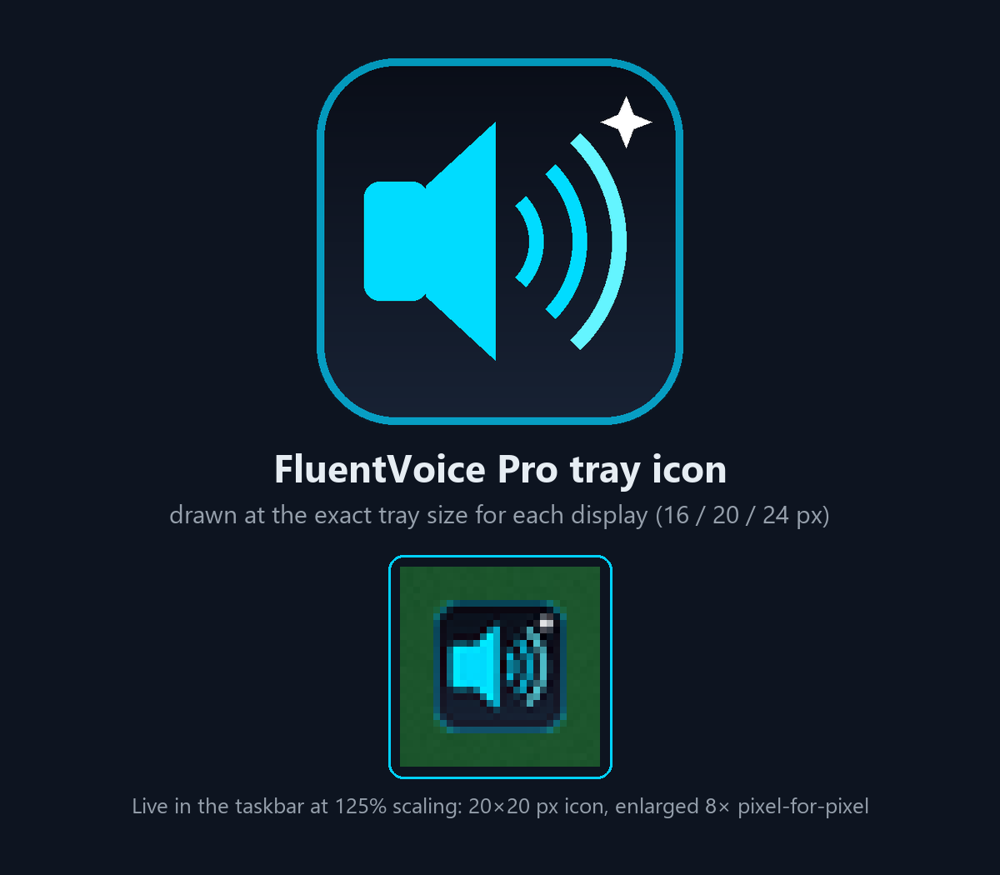</a><br>
      <b>07</b> — Tray icon · HD + live
    </td>
    <td align="center">
      <a href="screenshots/v1.6.2/08-settings-automation-preferred.png">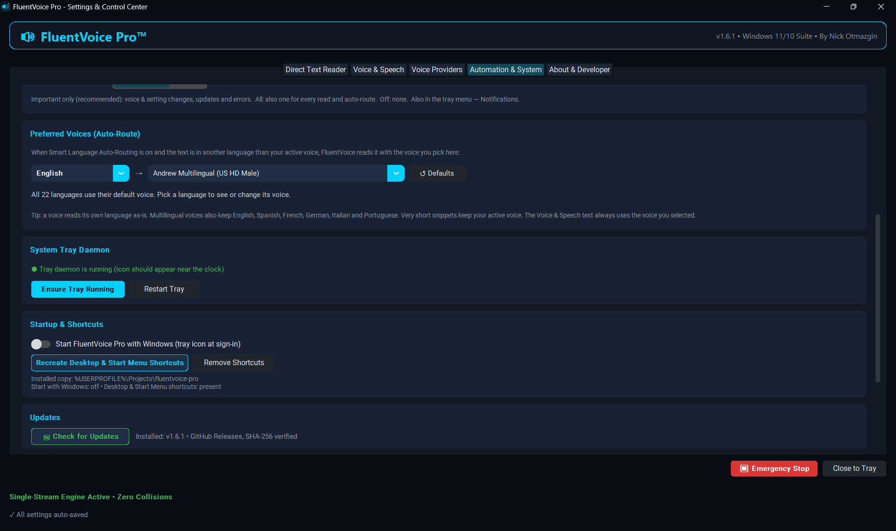</a><br>
      <b>08</b> — Preferred Voices · one compact row
    </td>
    <td align="center">
      <a href="screenshots/v1.6.2/09-tray-offline-voices.png">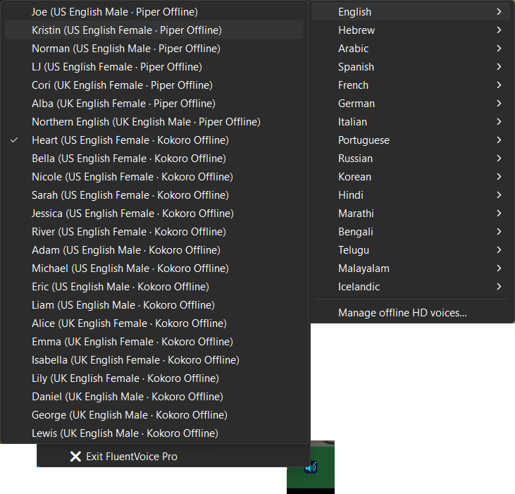</a><br>
      <b>09</b> — Tray · offline HD voices (Piper &amp; Kokoro) in two clicks
    </td>
  </tr>
  <tr>
    <td align="center">
      <a href="screenshots/v1.6.2/10-settings-voice-providers-mid.png">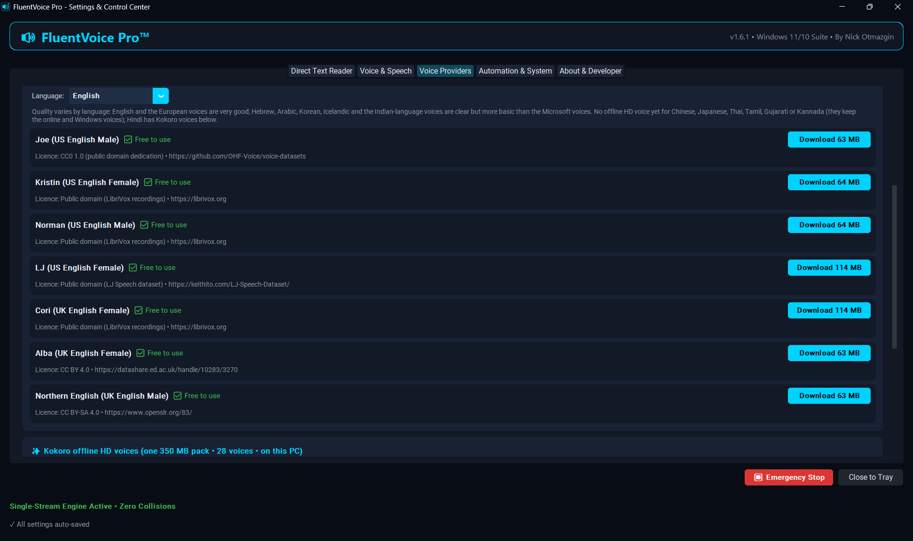</a><br>
      <b>10</b> — Voice Providers · Piper voices &amp; licences
    </td>
    <td align="center">
      <a href="screenshots/v1.6.2/11-settings-voice-providers-bottom.png">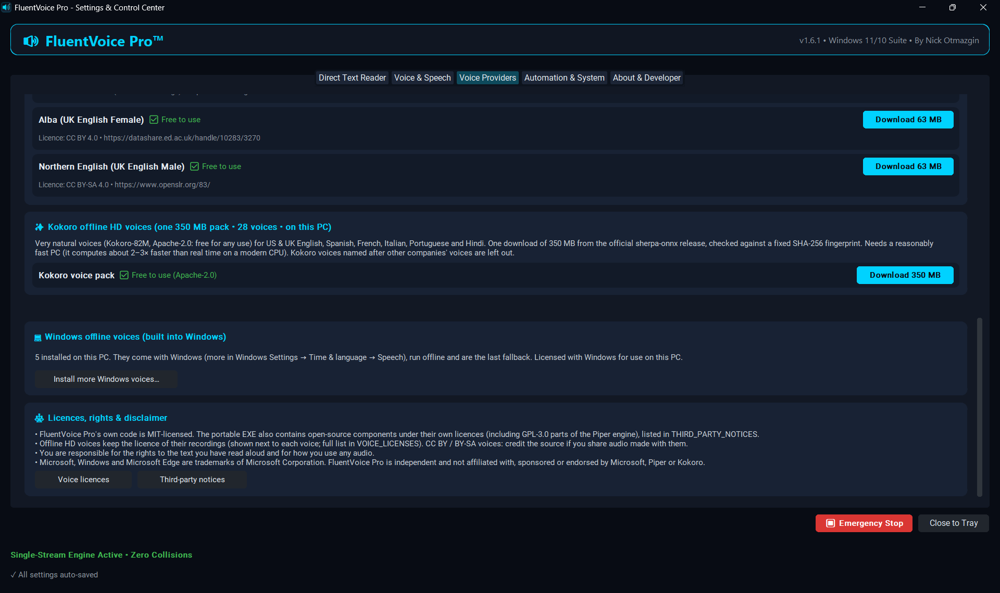</a><br>
      <b>11</b> — Voice Providers · Kokoro, Windows &amp; rights
    </td>
    <td align="center">
      <a href="screenshots/v1.6.2/12-settings-automation-bottom.png">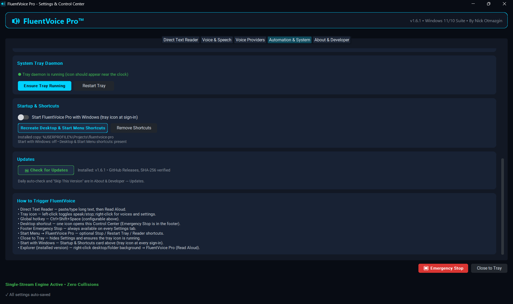</a><br>
      <b>12</b> — Automation · tray, startup, updates &amp; triggers
    </td>
  </tr>
</table>

Full combined image (download): [collage-v1.6.2.jpg](screenshots/v1.6.2/collage-v1.6.2.jpg)

---

## What Kind of Software Is FluentVoice Pro?

FluentVoice Pro is a **Native Windows 11 Desktop Application & Background System Tray Suite**.

- **Not a browser extension:** It is not restricted to browser tabs. It works everywhere across Windows: Cursor, VS Code, Slack, PDF readers, Notepad, Office, File Explorer, and terminals.
- **Not a bulky screen hog:** It runs quietly as a light (~30–60 MB RAM) background daemon in your notification area next to the clock.
- **Full Graphical Control Center:** When you want to tweak settings, adjust voice speed, or test voices, double-click the **FluentVoice Pro** desktop icon or right-click the tray to open the modern dark-themed Fluent Control Center.

---

## Highlights & Features

- 🛡️ **Guaranteed Single-Stream Playback (Zero Collisions):** An atomic generation tracker ensures that starting or requesting new speech instantly cancels any in-flight download and stops prior playback. No overlapping voices, ever.
- 📋 **Dedicated Direct Text Reader & Scratchpad:** Full-fledged scratchpad window in the Control Center to paste, review, and read long articles, PDFs, OCR texts, or code notes with live word/char counters and language tags.
- 🌐 **Smart Language Auto-Routing:** Detects 22 languages (English, Hebrew, Arabic, Spanish, French, German, Italian, Portuguese, Russian, Japanese, Chinese, Korean, Hindi, Marathi, Bengali, Tamil, Telugu, Gujarati, Kannada, Malayalam, Thai, Icelandic) and reads text in another language with your **Preferred Voice** for it (Automation & System). Pick them in one compact **Language ▸ Voice** row (online or offline voices). A voice always keeps its own language, **Multilingual** voices also keep English/Spanish/French/German/Italian/Portuguese, very short snippets keep your voice, and the **Voice & Speech test always plays the voice you picked**. The Reader status shows when a voice was auto-routed.
- ⏳ **Streaming Playback & Live Status:** Long texts are synthesized in small parts, up to three at a time ahead of playback, so speech starts in a few seconds and continues without pauses. Changing the voice, speed or pitch mid-read continues from the current sentence with the new settings. The Reader shows `Connecting… → 🔊 Speaking — voice • part 2/7 • 1:05 / 3:10 → ✔️ Finished`, with automatic offline fallback if the cloud voice stalls.
- ⬆️ **Built-in Update Checker:** Tray menu **Check for Updates…**, Settings → **Automation & System → Updates** and **About & Developer → Updates**, a green header badge and a release-notes popup. Downloads come straight from GitHub Releases and are **SHA-256 verified**; then **🚀 Install Now** (you confirm) installs and restarts FluentVoice. Git clones are told to `git pull` instead. Once-a-day anonymous check, switchable off. The Microsoft Store version gets its updates from the Store instead (no GitHub check).
- 🧹 **Advanced PDF, OCR & Niqqud Text Sanitizer:** Automatically repairs hyphenated line wraps from PDF copy-pastes, normalizes Unicode (NFKC), strips invisible zero-width and bidirectional markers, and cleans code blocks and markdown.
- 🎛️ **Modern Fluent UI Control Center:** Dark Fluent UI with voices, pitch, **volume**, speed, preferred auto-route voices, tray ensure/restart, and automation.
- ⌨️ **Global Hotkey:** Configurable chord (default `Ctrl+Shift+Space`) toggles speak/stop from any app: it reads the selected text (with nothing selected, what you copied). An optional second hotkey only stops. Settings warns when another app already uses the chord.
- 🔔 **Windows Notifications, your level:** *Important only* (default: voice & setting changes, updates, errors), *All* (also every read and auto-route) or *Off*, from Settings or the tray menu. Toasts are titled **FluentVoice Pro** with the app icon, rate-limited and de-duplicated.
- 🗣️ **80 HD Neural Voices in 22 Languages:** Microsoft Neural voices with a male *and* female option for every language — e.g. `Andrew`, `Ava`, `Christopher`, `Jenny`, `Sonia`, `Ryan`, `Avri`, `Hila`, `Hamed`, `Zariyah`, `Alvaro`, `Elvira`, `Henri`, `Denise`, `Conrad`, `Katja`, `Diego`, `Isabella`, `Antonio`, `Francisca`, `Dmitry`, `Svetlana`, `Keita`, `Nanami`, `Yunxi`, `Xiaoxiao`, `InJoon`, `Madhur`, `Swara`, `Pallavi`, `Premwadee`, `Gunnar`, `Gudrun`, `SunHi` — including US, UK, Australian, Canadian, Irish and Indian English. The **Preview & Test Voice** box switches to a sample sentence in the selected voice's language.
- 🖥️ **Offline HD Voices (Piper & Kokoro), on your PC:** Settings → **Voice Providers** downloads natural voices that work without internet; the text never leaves the computer. **Piper**: 29 voices for English, Spanish, French, German, Italian, Portuguese, Russian, Hebrew, Arabic, Korean, Marathi, Bengali, Telugu, Malayalam and Icelandic (60–115 MB each). **Kokoro**: one 350 MB pack, 28 very natural voices for English, Spanish, French, Italian, Portuguese and Hindi. Every voice was checked by transcribing its speech back to text. Every download comes from the official source and must match a fixed SHA-256 fingerprint. Each voice shows its licence: ✅ *Free to use* or 🏠 *Personal use only* ([full list](docs/VOICE_LICENSES.md)).
- 🛡️ **Privacy mode — Offline only:** one switch (Voice Providers tab or tray) and no text is ever sent online; each language uses an offline HD or Windows voice. If the online voice is unreachable, reading continues with an offline voice **of the same language**.
- ⚡ **Every Offline Windows Voice:** Lists both classic SAPI5 voices and the modern OneCore voices that Windows language packs install (e.g. George, Susan, Hebrew or Russian packs). The *Install Windows Offline Voices…* button opens Windows Speech settings to add more.
- 📋 **Auto-Read on Copy:** Optional mode that reads newly copied text after an adjustable stability buffer (0.3–1.5 s). Copying the same text again reads it again once the previous reading has finished; copies with no letters or digits, duplicate clipboard updates, **passwords marked private** by the copying app and **text that looks like a password or API key** are skipped (also for the tray click, hotkey and `--clip`), so secrets are never read aloud or sent to the cloud voice; texts are read up to 100,000 characters. Plain text only: formatting, images and files on the clipboard are skipped.
- 🎨 **Redesigned Ultra-Crisp Tray Icon & Dark Menus:** Transparent-background high-contrast neon cyan speaker glyph with native Windows 11 dark context menus and escaped Win32 menu accelerators.
- 🖥️ **Single Unified Desktop Shortcut & Tray Revive:** Desktop launcher opens Control Center and **Close to Tray** / **Ensure Tray** bring the icon back after Exit.
- 🚀 **Start with Windows:** Starts silently at sign-in (no console window) — the installer sets it up, the portable EXE asks once on first launch, and **Settings → Automation & System → Startup & Shortcuts** has the switch. In the Microsoft Store version Windows manages it (Settings → Apps → Startup).
- ✅ **Smoke checklist:** See [`docs/SMOKE_TEST.md`](docs/SMOKE_TEST.md) for a 2-minute release verification path.

---

## Compatibility

| Windows OS | Architecture | Status |
| :--- | :---: | :---: |
| **Windows 11 (24H2 / 23H2 / 22H2 / 21H2)** | x64 / ARM64 | **Validated & Recommended** |
| **Windows 10 (22H2 / 21H2)** | x64 | **Supported** |
| **Python Runtime** | 3.10 – 3.14+ | **Supported** |

---

## Installation

### Microsoft Store (easiest)

<a href="https://apps.microsoft.com/detail/9N293MJ0MD9F?mode=direct"></a>

**[Get FluentVoice Pro from the Microsoft Store](https://apps.microsoft.com/detail/9N293MJ0MD9F)** — free, signed by Microsoft, automatic updates, no Python needed. Or from a terminal:

```powershell
winget install 9N293MJ0MD9F --source msstore
```

### Downloads from GitHub

Two attested download options on **[Releases](https://github.com/nickotmazgin/fluentvoice-pro/releases/latest)** (green GitHub verification stamps when published by Actions):

> The `FluentVoicePro-<ver>-x64.msix` on Releases is the package sent to the Microsoft Store (Microsoft signs it there). To get the Store version, install it from the Store link above.

### Option A — Source ZIP + `install.ps1` (Recommended)

1. Download **`fluentvoice-pro-<ver>-windows.zip`**.
2. Extract the folder.
3. If Windows marks it blocked: right-click → **Properties** → **Unblock** → Apply (or `Unblock-File .\install.ps1`).
4. Right-click **`install.ps1`** → **Run with PowerShell**.

Requires **Python 3.10+** on PATH.

### Option B — Portable EXE ZIP (no Python)

1. Download **`FluentVoicePro-<ver>-portable-win64.zip`**.
2. Extract anywhere.
3. Unblock **`FluentVoicePro.exe`** if needed, then double-click to start the tray daemon.
4. On first launch it asks once: **Start with Windows + add Desktop & Start Menu shortcuts?** Choose **Yes** and it comes back after every reboot, like the installed version.
5. Change it any time in **Settings → Automation & System → Startup & Shortcuts** (Start with Windows switch, Create / Remove Shortcuts). If you move the folder, run `FluentVoicePro.exe` once from the new place and the shortcuts follow it.

SmartScreen / App Control / firewall notes: [`docs/WINDOWS_TRUST.md`](docs/WINDOWS_TRUST.md).

### Option C — Scoop

```powershell
scoop bucket add nickotmazgin https://github.com/nickotmazgin/scoop-bucket
scoop install nickotmazgin/fluentvoicepro
```

Installs the same portable EXE ZIP from Releases (SHA-256 checked) with a Start Menu shortcut and the `fluentvoicepro` command. Update with `scoop update fluentvoicepro`. Bucket: [nickotmazgin/scoop-bucket](https://github.com/nickotmazgin/scoop-bucket).

### From Source / Git

```powershell
git clone https://github.com/nickotmazgin/fluentvoice-pro.git
cd fluentvoice-pro
pip install -r requirements.txt
python -m fluentvoice.installer
```

---

## Quick Start & Triggers

1. **System Tray Icon (Next to Clock):**
   - **Left-Click**: Instant Toggle (Read clipboard / Stop speech immediately).
   - **Right-Click**: Open Direct Text Reader, Settings, switch voices (online, offline HD or Windows), toggle Auto-Read or **Offline Only (Privacy Mode)**, or access developer links.
2. **Global Hotkey:** `Ctrl+Shift+Space` (change under Automation & System).
3. **Desktop Shortcut:**
   - Double-click **`FluentVoice Pro`** to open the Control Center (brings an existing window to the front; revives tray if you previously Exit'ed).
4. **Windows Explorer Context Menu:**
   - Right-click any folder or desktop background $\rightarrow$ **`FluentVoice Pro (Read Aloud)`**.
5. **Command Line (CLI):**
   ```powershell
   fluentvoice "Hello world"      # Speak specific text
   fluentvoice --clip             # Speak current clipboard
   fluentvoice --stop             # Stop speech immediately
   fluentvoice --gui              # Open Settings & Control Center
   fluentvoice --reader           # Open Direct Text Reader scratchpad
   fluentvoice --about            # Open About & Credits window
   fluentvoice --check-update     # Check GitHub for a newer release
   fluentvoice --version          # Print installed version
   ```
6. **Updates:** Right-click tray → **Check for Updates…** (or Settings → Automation & System / About & Developer → Updates). When a new version is out you'll see a toast, a green **⬆ vX available** badge, and a popup with **Download & Verify → Install Now / Release Page / Skip This Version**.

---

## Architecture & Concurrency Model

```text
[ Trigger: Click / Shortcut / Auto-Copy / Direct Text Reader ]
                   │
                   ▼
       [ Atomic Generation Token (Gen ID++) ] ────► Invalidate prior downloads
                   │
                   ▼
   [ Cross-process claim + Hard Audio Purge ] ─► Tray & Settings never talk at once
                   │
                   ▼
     [ Voice engine for this text ]
       • Online HD    Microsoft voices, chunked streaming, 15 s timeout
       • Offline HD   Piper / Kokoro, computed on this PC, no network
       • Windows      SAPI / OneCore voices, on this PC, no network
       Fallback: online → offline HD → Windows (same language)
                   │
                   ▼
    [ Generation / Stop-signal Check ] ─► If superseded: DISCARD
                   │
                   ▼
  [ Named MCI Device Playback ] ──────► "FluentVoiceDevice" + stall watchdog
                   │                     (auto-fallback to offline voice)
                   ▼
  [ Live status → UI ] ───────────────► Connecting… → Speaking part i/n → Finished
```

### Troubleshooting speech

- Status stuck or no audio? Check `%USERPROFILE%\.fluentvoice\speech.log` — every synthesis/playback failure is logged there.
- Run the diagnostic from the repo folder: `python scripts\diag_reader_tts.py` (tests neural latency, MCI playback and offline voices).

---

## Links

- **Microsoft Store:** https://apps.microsoft.com/detail/9N293MJ0MD9F (free; `winget install 9N293MJ0MD9F --source msstore`)
- **Releases:** https://github.com/nickotmazgin/fluentvoice-pro/releases
- **Scoop:** https://github.com/nickotmazgin/scoop-bucket
- **Issues:** https://github.com/nickotmazgin/fluentvoice-pro/issues
- **Discussions:** https://github.com/nickotmazgin/fluentvoice-pro/discussions
- **AlternativeTo:** https://alternativeto.net/software/fluentvoice-pro/about/ (reviews and alternatives)
- **Write-up on DEV:** [FluentVoice Pro 1.6.1 is now in the Microsoft Store: free, open-source text-to-speech for Windows](https://dev.to/nickotmazgin/fluentvoice-pro-161-is-now-in-the-microsoft-store-free-open-source-text-to-speech-for-windows-5hjm)
- **Security:** [`SECURITY.md`](SECURITY.md) · [Report a vulnerability](https://github.com/nickotmazgin/fluentvoice-pro/security/advisories/new)
- **Privacy:** [`PRIVACY.md`](PRIVACY.md)
- **Contributing:** [`CONTRIBUTING.md`](CONTRIBUTING.md)
- **Windows trust / SmartScreen:** [`docs/WINDOWS_TRUST.md`](docs/WINDOWS_TRUST.md)
- **Smoke checklist:** [`docs/SMOKE_TEST.md`](docs/SMOKE_TEST.md)

<a href="https://alternativeto.net/software/fluentvoice-pro/about/?utm_source=badge&utm_medium=referral" target="_blank"></a>

## Other Open-Source Projects by Nick Otmazgin

- [ClipFlow Pro](https://github.com/nickotmazgin/clipflow-pro) — Advanced privacy-safe clipboard history manager for GNOME Shell 45–50 with pin, star, and export features.
- [Comfort Control (EaseHub)](https://github.com/nickotmazgin/comfort-control-easehub) — GNOME Shell panel menu for power, screenshots, updates & utilities.
- [Numeric Clock](https://github.com/nickotmazgin/Linux-Numeric-Date-And-Clock) — DD/MM/YYYY 24-hour top-bar clock with seconds.

---

## Credits & Acknowledgements

FluentVoice Pro is created, designed, maintained, and released by **[Nick Otmazgin](https://github.com/nickotmazgin)** — project administrator and solo maintainer.

- **Developer Email:** `nickotmazgin.dev@gmail.com`
- **Location:** Israel

[](https://cursor.com)
[](https://github.com/google-antigravity)
[](https://claude.com/claude-code)

<table>
  <tbody>
    <tr>
      <td align="center" valign="top" width="25%">
        <a href="https://github.com/nickotmazgin">
          
          <br />
          <sub><b>Nick Otmazgin</b></sub>
        </a>
        <br />
        <sub>Project Creator &amp; Solo Maintainer</sub>
        <br />
        <sub>💻 🎨 📦 🚀 📖</sub>
      </td>
      <td align="center" valign="top" width="25%">
        <a href="https://github.com/cursoragent">
          
          <br />
          <sub><b>Cursor Agent</b></sub>
        </a>
        <br />
        <sub>AI Pair-Programming Co-Pilot</sub>
        <br />
        <sub>💻 ⚙️ 🎧 📝</sub>
      </td>
      <td align="center" valign="top" width="25%">
        <a href="https://github.com/google-antigravity">
          
          <br />
          <sub><b>Google Antigravity</b></sub>
        </a>
        <br />
        <sub>AI Autonomous Engineering Agent</sub>
        <br />
        <sub>🧪 🤖 🔄 🛡️</sub>
      </td>
      <td align="center" valign="top" width="25%">
        <a href="https://github.com/claude">
          
          <br />
          <sub><b>Claude (Anthropic)</b></sub>
        </a>
        <br />
        <sub>AI Coding Agent · Claude Code</sub>
        <br />
        <sub>💻 🐛 🚀 🎨</sub>
      </td>
    </tr>
  </tbody>
</table>

Built with pair-programming assistance from AI co-pilots operated under the maintainer's direction, verification, and code review:

- **Cursor Agent** ([@cursoragent](https://github.com/cursoragent)) — Audio engine architecture, concurrency design, UI automation, and packaging
- **Google Antigravity** ([@google-antigravity](https://github.com/google-antigravity)) — System integration, Windows desktop testing, and performance profiling
- **Claude** by Anthropic ([@claude](https://github.com/claude), via [Claude Code](https://claude.com/claude-code)) — Streaming Reader + live status, cross-process Stop, update checker, release pipeline, UI fixes, and screenshots / collage (v1.4.17–v1.4.18)

---

## Legal & Trademarks Disclaimer

> **FluentVoice Pro™** is an unregistered trademark claim of **Nick Otmazgin**. The source code is free and open-source under the MIT License; the trademark claim covers the product name/brand only. The portable EXE also bundles open-source components under their own licences (including GPL-3.0 parts of the Piper engine), listed in [THIRD_PARTY_NOTICES.md](THIRD_PARTY_NOTICES.md).
>
> **Voices and rights, in plain words:**
> - **Microsoft online HD voices** are the voices Microsoft Edge's Read Aloud uses, reached through the open-source [edge-tts](https://github.com/rany2/edge-tts) library. This is **not an official Microsoft service for other apps**: Microsoft may change or stop it at any time (FluentVoice then continues with offline voices). Use it for personal reading. To publish or sell audio, use Microsoft's official paid service, [Azure AI Speech](https://azure.microsoft.com/products/ai-services/text-to-speech).
> - **Windows offline voices** come with Windows and are licensed with it for use on your PC.
> - **Piper and Kokoro offline HD voices** are downloaded by you from their official sources; each keeps the licence of its recordings, shown next to the voice and in [docs/VOICE_LICENSES.md](docs/VOICE_LICENSES.md) (✅ free to use, or 🏠 personal use only).
> - You are responsible for the rights to the text you have read aloud and for how you use any audio you make.
>
> Microsoft, Windows, Windows 11 and Microsoft Edge are trademarks of Microsoft Corporation. FluentVoice Pro™ is an independent open-source project and is **not** affiliated with, sponsored or endorsed by Microsoft Corporation, the Open Home Foundation (Piper), k2-fsa (sherpa-onnx) or the Kokoro authors.

---

## Support & Donations

If you find FluentVoice Pro™ useful, consider supporting continued development and maintenance:

[](https://www.paypal.com/donate/?hosted_button_id=4HM44VH47LSMW)

---

## License

Released under the **[MIT License](LICENSE)**. Copyright © 2026 Nick Otmazgin.  
**FluentVoice Pro™** — name/brand claim; MIT license applies to the software.

---

**GitHub topics:** `text-to-speech` · `tts` · `windows-11` · `windows-10` · `system-tray` · `read-aloud` · `edge-tts` · `customtkinter` · `accessibility` · `speech-synthesis` · `clipboard-reader` · `open-source`

**Search for:** Windows 11 text to speech tray app, FluentVoice Pro, Edge TTS reader, clipboard read aloud, offline SAPI voices, Fluent Control Center TTS
